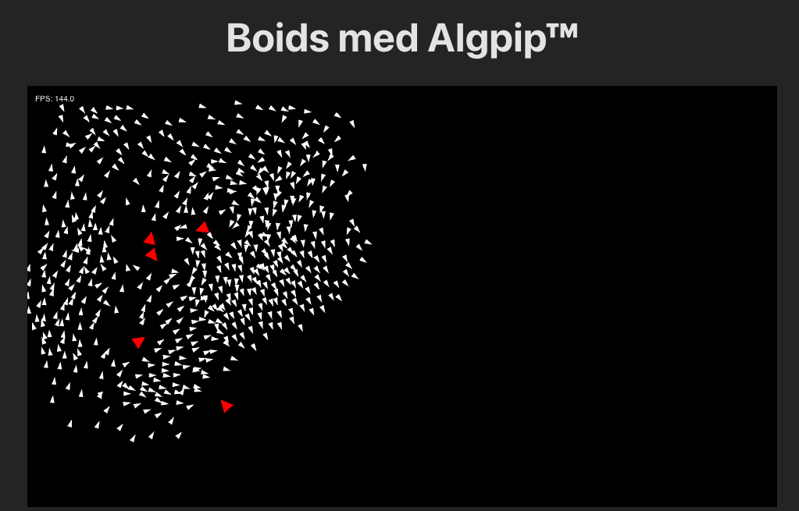

# Boids-workshop


## Installasjon og oppsett
```bash
yarn install
yarn dev
```

eller

```bash
npm install
npm dev
```

## Boids!!!

I dag skal vi lage *boids* - et enkelt simulasjonsprogram originalt oppfunnet i 1986.  
Boids brukes for å simulere flokkbevegelsen av dyr - spesielt fugler, men også fisker. Boids har blitt brukt i animasjon og i spill lenge.

Boids er et flott eksempel på *emergent behavior* - hvordan komplekse oppførsler og strukturer dukker opp fra enkle regler og byggeklosser.

I dag skal vi se på en kraft-basert versjon av boids. Hver regel "dytter" boiden i en retning, med en bestemt styrke. Kraften summeres opp, og endrer hastigheten, som til sist endrer posisjonen.


Det er fire ting jeg vil du skal være bevisst på:
1. Det blir en del vektormatte. Sorry.
1. Det ligger både hint og løsningsforslag til hver oppgave. Men, siden vi har lang tid og få oppgaver, **ha litt is i magen før du titter på løsningsforslaget**
1. Skru av Copilot! Dette er kjent materie, som den klarer litt for enkelt. Den kommer til å løse alt for deg, som du kommer til å få lite glede av.
1. Vær obs på at vektoroperasjonene **ikke** muterer vektoren. F.eks. `myVector.add(5)` forandrer ikke `myVector`, det bare produserer en ny vektor. Fort gjort å bomme på!


Vi skal arbeide i fila [src/boids.ts](./src/boids.ts)

> 💡 **Visste du?**  
> Navnet *boid* er både en forkortelse av *bird-oid object*, men også en referanse til hvordan man uttaler *bird* med en tykk New York-aksent

## Grunnreglene

### Alignment
Akkurat som for tverrfaglige team er det også viktig for flokkdyr å trekke i samme retning.  
Dette kaller vi *alignment*.

Vi skal arbeide med metoden `alignmentForce` i fila [src/boids.ts](./src/boids.ts)

Beregning av denne kraften kan beskrives ganske rett frem: finn gjennomsnitts*retningen* til alle naboene.

**Hint:**
<details> 
<summary>💡 Hva mener du med retning?</summary>

En retning er en normalisert vektor, altså en vektor hvor lengden av den er 1. Med retningen til en boid, mener vi altså retningen til hastighetsvektoren.  
Hastighetsvektoren til en boid heter `.velocity`. Vi kan normalisere vektorer ved å kalle `.normalize()`.
</details>
<details>
<summary>💡 Kan du forklare det med litt flere ord?</summary>

Seff kan jeg det!  
Retning
For å finne gjennomsnittsretningen, kan vi legge sammen *hastigheten* (`.velocity`) til naboene, og så normalisere resultatet. Vi kan legge sammen vektorer med `.add()`.
</details>
<details>
<summary>🤓 Løsningsforslag</summary>

```ts
function alignmentForce(neighbors: Boid[]): Vector2 {
  if (neighbors.length === 0) {
    return new Vector2(0, 0);
  }

  let totalVelocity = new Vector2(0, 0);
  for (const boid of neighbors) {
    totalVelocity = totalVelocity.add(boid.velocity);
  }
  return totalVelocity.normalize();
}
```
</details>


### Cohesion
Flokkdyr vil gjerne være sammen.  
Innen boids kaller vi dette *cohesion*.
Kraften for cohesion kan beregnes på følgende måte:
* finn gjennomsnittposisjonen til alle naboene
* finn vektoren som peker fra boidens posisjon, til denne gjennomsnittsposisjonen
* finn retningen på denne vektoren ved å normalisere den

Vi skal arbeide med metoden `cohesionForce` i fila [src/boids.ts](./src/boids.ts)

**Hint:**
<details>
<summary>💡 Finne gjennomsnittet av naboposisjoner</summary>

Summer opp posisjonene med `.add()` og del på antallet naboer med `.div()`.  

Hva skjer hvis en boid ikke har noen naboer?
</details>
<details>
<summary>💡 Finne vektoren som peker fra boiden til gjennomsnittet</summary>

Å finne en vektor som "peker fra den ene til den andre", gjør man ved å ta den andre minus den første. Dette kan man gjøre med `.sub()`.
</details>
<details>
<summary>🤓 Løsningsforslag</summary>

```ts
function cohesionForce(boid: Boid, neighbors: Boid[]): Vector2 {
  if (neighbors.length === 0) {
    return new Vector2(0, 0);
  }

  let sumOfPositions = new Vector2(0, 0);
  for (const boid of neighbors) {
    sumOfPositions = sumOfPositions.add(boid.position);
  };
  const averageNeighborPosition = sumOfPosition.div(neighbors.length);
  const vectorToAveragePosition = averageNeighborPosition.sub(boid.position);

  return vectorToAveragePosition.normalize();
}
```
</details>

### Separation
Samarbeid er vel og bra, men av og til trenger vi alle litt personal space.
På boide-språk kalles dette *separation*.  

Vi skal arbeide med metoden `separationForce` i fila [src/boids.ts](./src/boids.ts)


Dette er den mest kompliserte kraften så langt!
* Opprett en kraftvektor: en ny vektor med verdi `(0, 0)`
* For hver nabo, sjekk om de er nærmere enn `collisionRadius`
* Hvis de er det, vil vi ha en kraft som er sterkere jo nærmere de er:
    * `styrke = (collisionRadius - avstand) / collisionRadius`
    * øk kraftvektoren med en vektor som peker vekk fra naboen, med lengde `styrke`
* returner kraftvektoren 

> 💡 Dette er den eneste kraften (så langt) med varierende stykre!  
> De andre har enten styrke 0 eller 1, mens denne har altså mer styrke jo flere naboer boiden har og jo nærmere de er

**Hint:**
<details>
<summary>💡 Finne avstand til naboen</summary>

Naboens position er `.position`.
Man kan finne avstand fra en vektor til en annen ved hjelp av `.distanceTo()`.  

Meeen, her kommer vi straks til å trenge *retningen* mot naboen også (frampek).  
Da kan vi heller finne vektoren som peker fra naboen til denne boiden med `.sub()`. Avstanden mellom de to er da lengden av denne vektoren, som vi kan finne med `.length()`.
</details>
<details>
<summary>💡 Peke vekk fra naboen?</summary>

Dette handler om retning!  
For å finne en vektor som peker "vekk fra naboen", kan vi også finne en vektor som peker fra naboen til denne boiden, det blir akkurat det samme.
Å finne en vektor som "peker fra den ene til den andre", gjør man ved å ta den andre minus den første. Dette kan man gjøre med `.sub()`.
</details>
<details>
<summary>💡 Sette lengde på en vektor</summary>

Hvis du har en vektor som peker i riktig retning, og en lengde du gjerne vil at den skal være, da er du på rett spor!  
Her finnes det flere veier til Rom. Man kan tenke seg at man vil sette lengden til å være 1, sånn at man kan gange hele vektoren med den ønskede lengden.  
Den mest knotete måten å gjøre dette på, er en kombinasjon av `.div()`, `.length()` og `.mul()`.  
Det å dele på vektorens egen lengde for å få en vektor med lengde 1 gjør man så ofte at vi har et navn for det - normalisering - og en tilhørende metode: `.normalize()`. Da mangler man bare `.mul()`!

Men, det å sette lengden på en vektor er også noe som har blitt gjort akkurat ofte nok til at det har blitt laget en hjelpemetode som gjør alt arbeidet for deg! `.withLength()` fikser biffen 🥩
</details>
<details>
<summary>🤓 Løsningsforslag</summary>

```ts
function separationForce(
  boid: Boid,
  neighbors: Boid[],
  collisionRadius: number
): Vector2 {
  if (neighbors.length === 0) {
    return new Vector2(0, 0);
  }

  let separationForce = new Vector2(0, 0);

  for (const neighbor of neighbors) {
    const fromNeighbor = boid.position.sub(neighbor.position);
    const distance = fromNeighbor.length();
    if (distance < collisionRadius) {
      const strength = (collisionRadius - distance) / collisionRadius;
      const forceFromNeighbor = fromNeighbor.withLength(strength);
      separationForce = separationForce.add(forceFromNeighbor);
    }
  }

  return separationForce;
}
```
</details>

## Litt mer!

### Predator avoidance
Du har kanskje sett noen røde boid-aktige karer som flyr inn i flokken? Det er *predators*, og de vil vi holde oss unna.

Vi skal arbeide med metoden `predatorAvoidanceForce` i fila [src/boids.ts](./src/boids.ts)

Denne løses veldig likt som separation.
* Opprett en kraftvektor: en ny vektor med verdi `(0, 0)`
* For hver predator, sjekk om de er nærmere enn `predatorRadius`
* Hvis de er det, vil vi ha en kraft som er sterkere jo nærmere de er:
    * `styrke = (predatorRadius - avstand) / predatorRadius`
    * øk kraftvektoren med en vektor som peker vekk fra predatoren, med lengde `styrke`
* returner kraftvektoren 

<details>
<summary>🤓 Løsningsforslag</summary>

```ts
function predatorAvoidanceForce(
  boid: Boid,
  predators: Boid[],
  predatorRadius: number
): Vector2 {
  if (predators.length === 0) {
    return Vector2.zero;
  }

  let avoidanceForce = new Vector2(0, 0);
  for (const predator of predators) {
    const fromPredator = boid.position.sub(predator.position);
    const distance = fromPredator.length();
    if (distance < predatorRadius) {
      const strength = (predatorRadius - distance) / predatorRadius;
      avoidanceForce = avoidanceForce.add(fromPredator.withLength(strength));
    }
  }
  return avoidanceForce;
}
```
</details>

### Mouse attraction
Og du har kanskje lagt merke til at når du holder musepekeren over canvaset tegnes det en ring rundt!
Kanskje du tilogmed har fanget opp den skaleres opp og ned med scrolling?  
På tide at boidsene legger merke til den også!

Vi skal arbeide med metoden `mouseAttractionForce` i fila [src/boids.ts](./src/boids.ts)

Her kan du enten implementere en fast kraft som er like sterk innenfor hele radiusen, eller en avstandsbasert styrke slik som for separation og predator avoidance.

<details>
<summary>🤓 Løsningsforslag</summary>

```ts
function mouseAttractionForce(
  boid: Boid,
  mousePosition: Vector2 | null,
  mouseRadius: number
): Vector2 {
  if (!mousePosition) {
    return Vector2.zero;
  }

  const toMouse = mousePosition.sub(boid.position);
  const distance = toMouse.length();
  if (distance > mouseRadius) {
    return Vector2.zero;
  }
  const strength = 1 - distance / mouseRadius;
  return toMouse.withLength(strength);
}
```
</details>

### Hva gjør jeg nå?

Først og fremst, gratulerer! 🎉  
Si gjerne ifra at du ble ferdig - det er første gang workshopen kjøres, og jeg aner ikke hvor lang tid den vil ta 🤷‍♂️  

Se om det er noen som står fast du kan hjelpe, eller nyt tiden med litt boid-basert frilek!  
Forslag til ting du kan gjøre:
* tweak litt på parameterne!
    * skjer det noe gøy hvis du setter opp noen rare verdier?
* mer effektiv nabo-sjekking!
    * klassen som sjekker hvilke boids som er nabo med hvilke heter `NaiveBoidCollection` og ligger i [src/boidCollection.ts](./src/boidCollection.ts)
    * den heter "Naive", fordi den sjekker om alle er nabo med alle - kan vi gjøre noe litt glupere?
    * hint - søk opp Spatial Hashing!
* økosystem
    * boids lager boids over tid
    * predators spiser boids når de kommer nære
    * predators som har spist nok, lager flere predators
    * predators som spiser for lite, sulter ihjel 😢
* smartere predator-oppførsel
    * akkurat nå bare velger de en tilfeldig boid og jakter den til de "går lei"
    * kanskje de skulle siktet seg inn på større flokker av boids?
* ytelsesmaksing 💪
    * det er tatt en god del valg her som ikke er prima for ytelsen
    * klarer du å bedre den? hvor mange boids klarer du å ha, og likevel treffe 60fps?
* fikse UXet
    * plis 🙏